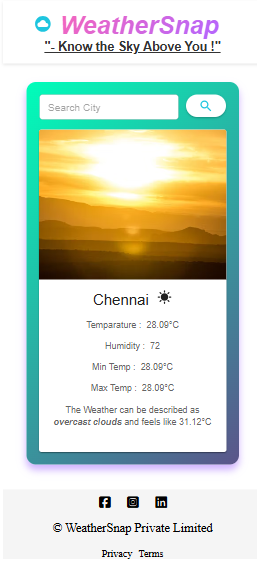
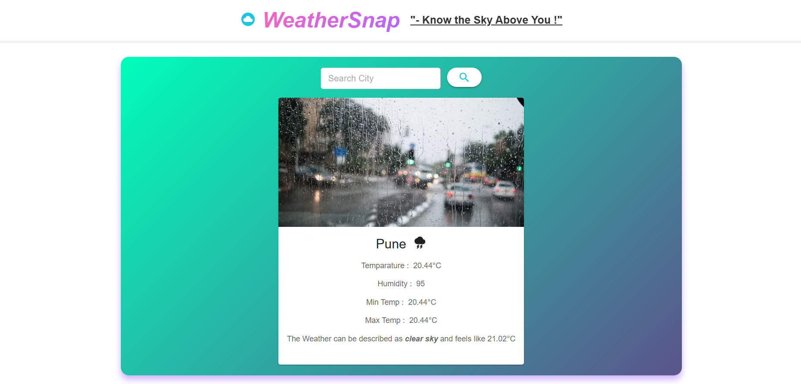
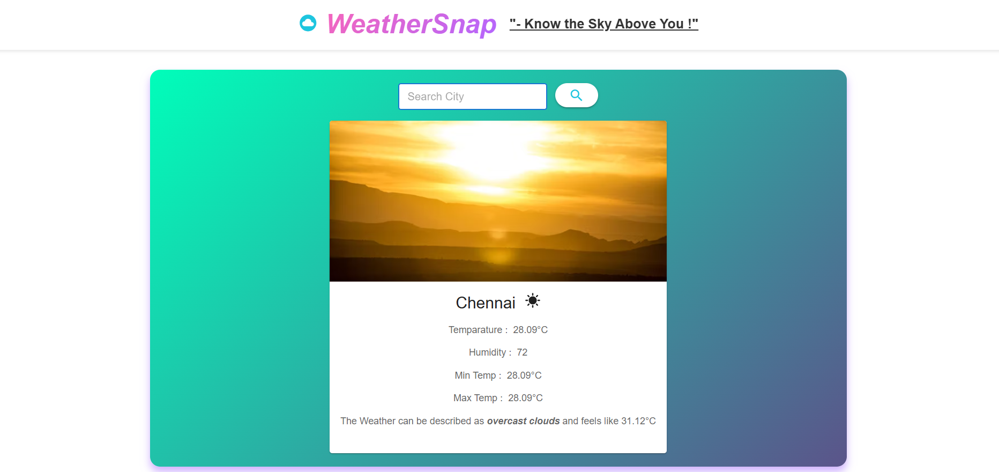
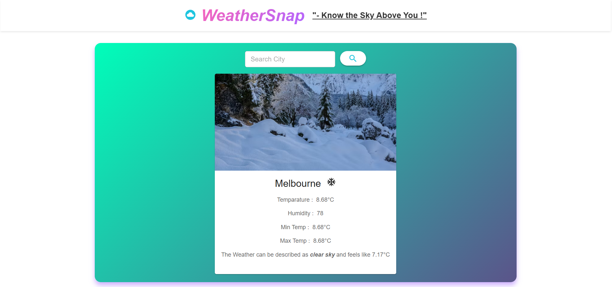

# WeatherSnap


## Description
**WeatherSnap** is a responsive weather application built with **React** and **Material-UI**. Users can search for any city and instantly get current weather information, including temperature, humidity, minimum and maximum temperatures, and weather descriptions. The app features a clean, modern interface with a **pink-purple gradient title**, a tagline, and responsive design for desktop, tablet, and mobile devices.

**Key Features:**
- Search for any city to retrieve current weather data.
- Interactive and responsive UI built with Material-UI.
- Weather visualization with icons and background images based on conditions (sunny, rainy, or cold).
- Error handling for invalid city names.
- Footer with social links and branding information.

---
## Screenshots

### 1. Mobile Responsiveness


### 2. Rainy Weather Display


### 3. Sunny Weather Display


### 4. Winter Weather Display


---
## Project Structure
src/
│
├─ App.jsx # Main app component, contains navbar, WeatherApp, and footer
├─ WeatherApp.jsx # Handles state for weather info and renders SearchBox and InfoBox
├─ SearchBox.jsx # Input field and button to search for cities and fetch weather data
├─ InfoBox.jsx # Displays weather information with icons and Card layout
├─ App.css # Styles for App.jsx
├─ weatherApp.css # Styles for WeatherApp component
├─ SearchBox.css # Styles for SearchBox component
├─ InfoBox.css # Styles for InfoBox component


---

## Installation & Setup

1. Clone the repository:
```bash
git clone https://github.com/your-username/WeatherSnap.git
cd WeatherSnap

2. Install dependencies:
npm install


3. Create a .env file in the root directory with the following keys:

VITE_GEOCODING_API_URL=your_geocoding_api_endpoint
VITE_WEATHER_API_URL=your_weather_api_endpoint
VITE_API_KEY=your_api_key
VITE_SUN_URL=url_for_sunny_background_image
VITE_RAIN_URL=url_for_rainy_background_image
VITE_WINTER_URL=url_for_cold_background_image


Note: The .env file is ignored in GitHub. You may create a .env.example to show required variables.

4. Run the app locally:

npm run dev
This will start the development server (Vite) and open the app in your browser, typically at http://localhost:5173.

---
**Running Tests**

Currently, the project does not include automated tests.

Future enhancement: Add unit tests for key components (SearchBox, WeatherApp, InfoBox) using Jest or React Testing Library.
When tests are added, you can run:

npm test

---
**Usage Instructions**

1.Open the app in your browser.

2.Type a city name in the search box and click the search button (magnifying glass).

3.If the city exists:

 The weather card will update with temperature, humidity, min/max temperature, and description.

 The background image changes based on weather conditions (sun, rain, cold).

4.If the city does not exist, a warning alert appears: "No Such Place Exists!".

---
**Assumptions and Design Choices**

Assumptions:

1.Users will input valid city names.

2.The app requires internet access to fetch data from external APIs.

3.Only current weather conditions are displayed; no forecasts for future days.

Design Choices:

1. React Functional Components and hooks (useState) for state management.

2. Material-UI components (TextField, Button, Card, Alert, Icons) for a clean, modern UI.

3. Gradient title (pink-purple) for visual appeal.

4. Responsive design using Flexbox, media queries, and Material-UI responsive props.

5. Weather visualization dynamically changes based on temperature and humidity.

6. .env file for API keys to ensure security and flexibility.

7. Footer includes social links and branding.

**Future Enhancements:**

1. Add 5-day or weekly weather forecast for each city.

2. Include weather icons or animations for real-time visualization.

3. Add location-based search using browser geolocation.

4. Implement unit tests for better reliability.

5. Enhance accessibility and internationalization for multi-language support.
